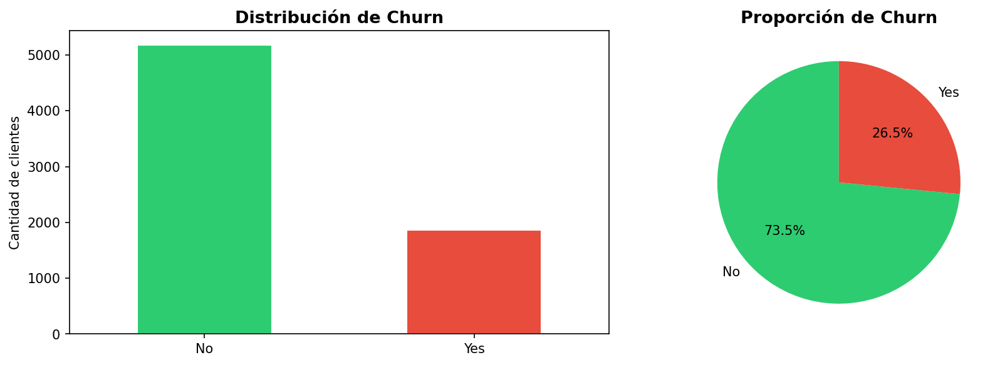
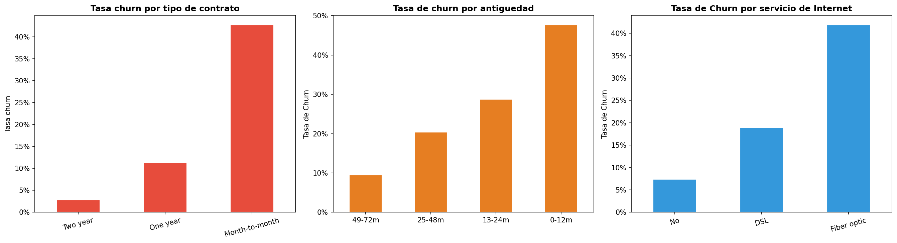

# 📉 Churn Prediction — Retención de Clientes SaaS

> **¿Pueden los datos predecir qué clientes van a cancelar el servicio
> antes de que lo hagan?**
> Este proyecto demuestra cómo el análisis de datos y machine learning
> pueden responder esa pregunta y convertirla en acción comercial concreta.

---

## 🧩 El problema

Imaginate que tenés 7.000 clientes y **1 de cada 4 está a punto de cancelar
el servicio**. No sabés cuáles. Tu equipo de atención al cliente llama a todos
por igual, sin prioridad, sin criterio.

Ese es el problema que resuelve este proyecto.

Una tasa de cancelación (churn) del **26.58%** representa una pérdida
significativa de ingresos recurrentes. El objetivo es identificar con
anticipación qué clientes están en riesgo, para que el equipo comercial
pueda actuar antes de que sea tarde.

---

## 💡 La solución

Usando técnicas de análisis de datos y machine learning, este proyecto:

- **Identifica los factores** que llevan a un cliente a cancelar el servicio
- **Construye un modelo predictivo** que asigna un nivel de riesgo a cada cliente
- **Genera una lista priorizada** de clientes a contactar para retención

---

## 🔍 Principales descubrimientos

Los datos revelaron tres factores críticos que predicen la cancelación:

### 1. El tipo de contrato es el predictor más fuerte
Los clientes con contrato **mes a mes** cancelan a una tasa del **42%**.
Los clientes con contrato **bianual** cancelan solo el **3%** de las veces.

> 💬 *Conclusión de negocio: los clientes sin compromiso contractual
> tienen 14 veces más probabilidad de cancelar.*

### 2. Los primeros 12 meses son críticos
El **47% de los clientes nuevos** (menos de 1 año) cancela el servicio.
Después de 4 años como cliente, esa tasa cae al **9%**.

> 💬 *Conclusión de negocio: el período de onboarding es la ventana
> más importante para fidelizar al cliente.*

### 3. El servicio de fibra óptica tiene un problema de retención
Los clientes con **fibra óptica** cancelan al **42%** vs **7%** de los
clientes sin servicio de internet.

> 💬 *Conclusión de negocio: existe una posible brecha entre el precio
> cobrado y el valor percibido en este segmento.*

---

## 👤 Perfil del cliente en riesgo

Un cliente tiene **alta probabilidad de cancelar** si cumple estas condiciones:

| Factor | Valor de riesgo |
|---|---|
| Antigüedad | Menos de 12 meses |
| Tipo de contrato | Mes a mes |
| Servicio de internet | Fibra óptica |

---

## 📊 Visualizaciones

**Distribución de cancelaciones:**

**Churn por variables clave:**

---

## 🛠️ Herramientas utilizadas

| Herramienta | Para qué se usó |
|---|---|
| Python | Análisis y modelado de datos |
| Pandas | Limpieza y transformación de datos |
| Matplotlib / Seaborn | Visualización de resultados |
| Scikit-learn | Construcción del modelo predictivo |
| Power BI | Dashboard ejecutivo (próximamente) |
| Git / GitHub | Control de versiones profesional |

---

## 📁 Estructura del proyecto

da-churn-prediction-saas/
├── notebooks/
│   ├── 01_eda.ipynb          ← Análisis exploratorio de datos
│   ├── 02_cleaning.ipynb     ← Limpieza y preparación (en desarrollo)
│   └── 03_modeling.ipynb     ← Modelo predictivo (en desarrollo)
├── reports/                  ← Gráficos y visualizaciones
├── data/
│   ├── raw/                  ← Datos originales
│   └── processed/            ← Datos procesados
└── src/                      ← Scripts reutilizables 

---

## 🚦 Estado del proyecto

- [x] Análisis exploratorio de datos
- [x] Análisis bivariado e hipótesis de negocio
- [ ] Feature engineering y preparación del modelo
- [ ] Modelo predictivo de clasificación
- [ ] Dashboard ejecutivo en Power BI
- [ ] Reporte ejecutivo para stakeholders

---

## 👨‍💻 Autor

**Franco Caneto**
Data Analyst | Ciencias de Datos e IA

📍 Córdoba, Argentina
💼 [LinkedIn](https://linkedin.com/in/franco-caneto)
🎓 Tecnicatura en Ciencias de Datos e IA — IES Colegio Universitario